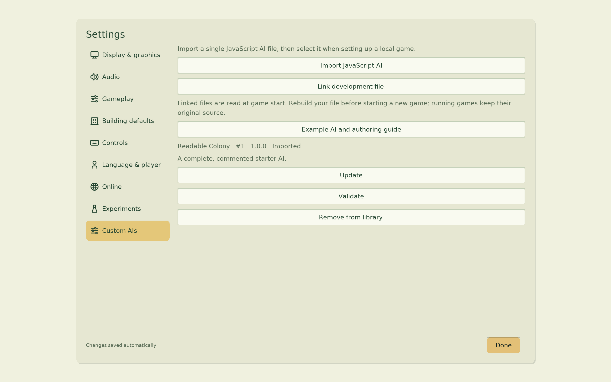
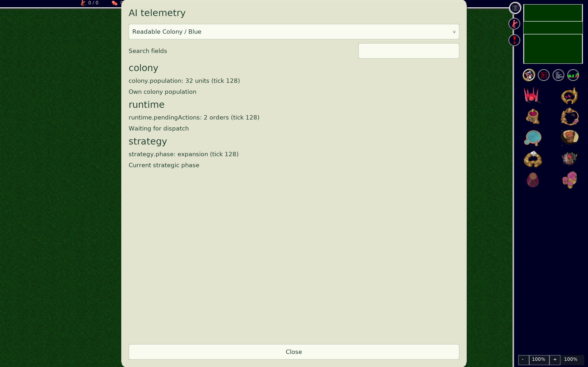

# Globulation 2 JavaScript AI example

A readable colony AI demonstrating API profile 2. It grows food capacity, builds
training facilities, upgrades, explores, attacks, zones a guard area, and publishes
telemetry. Playing strength is deliberately secondary to clarity.

Requires a Glob2 build supporting **JavaScript API profile 2 / save format 129**.
The compatible engine commit is pinned in [engine.json](engine.json); its integration
is tracked in [Glob2 PR #645](https://github.com/Globulation2/glob2/pull/645).
Do not use a profile-1-only release.

## Build and install

1. Use this template, clone your repository, and install Node.js.
2. Run `npm ci`, then `npm run build`. The output is `dist/example.js`.
3. In Glob2, open **Settings → Custom AIs → Import JavaScript AI** and select it.
4. In local game setup, choose **Readable Colony** for a computer-controlled seat.
5. During play open **Menu → AI telemetry**. Own/allied controllers are visible;
   spectating and replays show all controllers.

Share only the bundled file. Other players do not need Node.js. Each game embeds
its exact source, so updates cannot silently change an active or saved game.
The library's **Update** action replaces an existing entry after validation.
Duplicate display names are allowed; entries have separate local identities.

## Develop

On desktop, use **Link development file** with the absolute path to
`dist/example.js`, then run `npm run watch`. Each completed build is published by
atomic rename; failed builds retain the prior bundle. Glob2 reads linked files
when starting a game, then keeps that version throughout the match. Start a new
game to test a rebuild. **Relink** changes the path; removing a link never deletes
your source. Browser and Android use imports and updates instead of external links.

Run `npm run types` for JSDoc/editor checks. Run `GLOB2_BIN=/path/to/glob2 npm run
check` for the engine's startup, metadata, callback, and initial-persistence check.
This is stronger than compile-only `--check-script`, but gameplay still needs tests.

## Code map

- `src/index.js`: metadata, callback scheduling, shared observations.
- `src/economy.js`: staffing, production, food capacity, native placement, zoning.
- `src/technology.js`: tracked repair and upgrade requests.
- `src/military.js`: observed threats, exploration and attacks; exact-coordinate
  flag creation alongside the recommended native building placement API.
- `scripts/build.mjs`: pinned esbuild bundle/watch with atomic output publication.
- `types/`: engine-authored declarations, used only through JSDoc.

See [API recipes and execution model](docs/API.md) for the transaction, observation,
placement and persistence contracts. `npm test` exercises watch rebuilds and failed
builds, including preservation of the previously published bundle.

## Rules that matter

Module variables persist automatically. Store numbers, strings, booleans, arrays,
and ordinary records. Store `building.ref`, then reacquire with
`ctx.game.building(ref)`. Managed buildings and spatial fields expire after the
callback. Persistent closures, class instances, runtime-created functions, runtime
imports, clocks, filesystem and network access are unsupported.

Owned building property edits become normal queued orders. Getters show pending
desired values; `.observed` shows the last simulation values. Repeated edits
coalesce without moving their queue position. Only one order is dispatched per AI
poll. `ctx.actions.status(id)` distinguishes pending, issued, constructing,
completed, failed and cancelled projects. A found placement can still fail when
its order reaches the game. Never assume a queued construction already exists.

Spatial queries run synchronously in native code and use observed information.
Hidden enemies are unavailable; terrain and fertility may be remembered under fog.
Null reachability/distance means unknown information, not an arbitrarily large
number. Cache hits use the same deterministic budget as recomputation. Schedule
expensive planning using `ctx.tick`, restrict placement regions, and avoid
repeated whole-map queries. The example uses one economy decision every 128 ticks
and staggers technology/military work.

The engine API reference is authoritative:
[JavaScript API](https://github.com/Globulation2/glob2/blob/master/docs/development/javascript-api.md).
The declaration copies must match the engine revision recorded in `engine.json`.

## Qualification

Before sharing changes, run build, types, and engine check; then play fixed-seed
local matches and save/resume mid-construction. Verify food growth, training,
upgrades, exploration, attack flags and guard zoning in telemetry/replays. Winning
is not required. Keep screenshots and replay evidence outside source modules.

## Qualify a strategy change

Run `GLOB2_BIN=/absolute/path/to/glob2 npm run qualify`. This runs a fixed-seed
complete-game scenario and checks food expansion, training, completed upgrades,
exploration, attack planning and zoning. It then compares every resumed team/entity
record with uninterrupted play using one and four compute workers. The command
retains logs, saves, replays and checksum traces under ignored `artifacts/`.
It fails if a behavior is not exercised, even if the script never throws.
